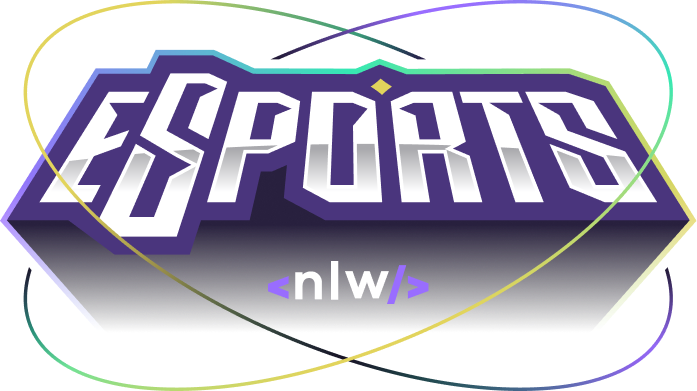
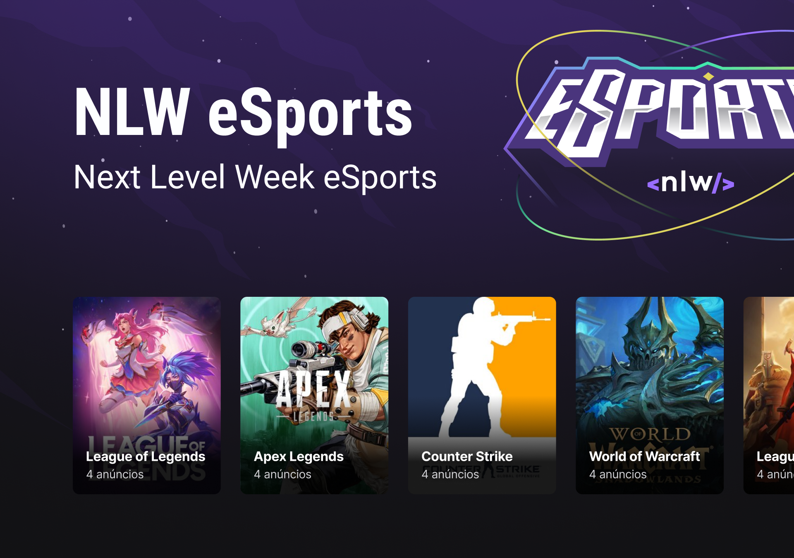

<h1 align="center">
    
</h1>

<div align="center">
    <h3> 🟣 Projeto inédito do universo dos games. 🟣 </h3>
    <a href="https://rocketseat.com.br/" target="_blank">
      
    </a>
    <a href="https://github.com/PedroCantanhede" target="_blank">
      
    </a>
     
    
    
</div>

# NLW eSports

Essa aplicação desenvolvida no Ignite Lab consiste em uma plataforma no universo dos games onde você localiza seu duo para jogarem juntos.

<p align="center">
  
</p>

# 🔨 Tecnologias

💻 React / React Native

💻 TypeScript

💻 Node JS

💻 Prisma

💻 Tailwind CSS

## :rocket: Instalação

```bash
# Clone o repositório
$ git clone https://github.com/PedroCantanhede/eSports.git

# Instale as dependências
$ npm install / yarn install

# Execute a aplicação
$ npm run dev / yarn dev

# Abra o projeto na porta: 3000 - acessando: http://localhost:3000
```
## 🔖 Layout

Você pode visualizar o layout do projeto através [desse link](https://www.figma.com/community/file/1150897317533332617). É necessário ter conta no [Figma](https://figma.com) para acessá-lo.

## :infinity: Ajuda da Rocketseat

A ajuda das aulas disponibilizadas durante a semana e a comunidade da Rocketseat foram essenciais para que eu chegasse no final do projeto. Deixo também meus agradecimentos aos professores **Diego Fernandes** e **Rodrigo Gonçalves**.
[Venha e participe da comunidade da Rocketseat!!!](https://www.rocketseat.com.br/)
